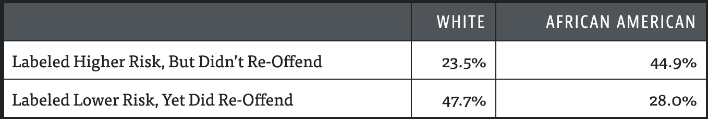
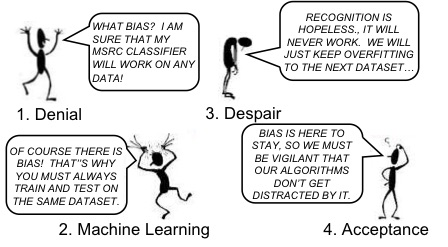

# Ethics: Dataset bias and it's consequences

## Introduction 

Facial Recognition software has disproportinately higher error rates on both women, and darker skinned individuals. A 2018 study on three commerical grade gender-classifiers found error rates in classifying darker skinned females were up to 42 times greater than error rates in classifying lighter skinned men [@gebru2018]. Across the board classifiers performed better in classifying male faces than female faces, and all classifiers performed better on lighter faces than on darker faces. These classifiers were not developed by unknown companies, they were developed by IBM, Microsoft, and Face++. In other words, these were commercial products that were developed for the sole purpose of gender classification. 

Even on a more practical level @torralba2011 lays out the issue with dataset bias amongst common computer vision datasets. Specifically, by training a model to detect objects amongst multiple common datasets in the field, and then making predictions on other common datasets in the field, one would expect relatively decent performance. In fact, the results show some severe problems. For example, one model tagged an image of a sofa as a "car". The issue is, again, in effect, dataset bias and a lack of representation from the datasets that are available.

## The problem

There are over 23 sorts of bias, many of which will be listed below. Most commonly, the issues appear in two forms: exclusion bias, or measurement bias. 

Exclusion bias occurs when the sample population does not represent the population distribution as a whole. Perhaps a health insurance company seeks to build a model, and while they are trying to create a model for the entire country, they decide to pull training data from the city of Denver. While Denver is a perfectly fine city, the population distribution of Denver will not reflect the United States as a whole. According to the US Census, Denver is roughly 55\% white and 10\% black, whereas Colorado as a whole is roughly 68\% white and 5\% black, and the US as a whole is roughly 60\% white and 13\% white. Obviously no dataset is going to be perfect, but efforts must be made to rebalance the dataset against the specific sort of imbalance ocurring here. 

Exclusion bias does not just occur with regards to racial imbalance, it can also occur due to improper balancing of socioeconomic status, age, or gender. In addition, exclusion bias does not merely affect populations; it can also refer to the actual data collected.  For example, predictive software has been developed to predict rates of reoffending for prisoners. In turn, this data is then used to determine length of sentence. Individuals with high scores are likely to receive longer sentences. A multitude of data points go into these statistical models, and an unfortunate side effect of much of this research is that it discriminates against it's users. Individuals with incredibly similar histories, but different racial backgrounds experience vastly different sentences [@angwin2016].

```{r propublica, echo = FALSE, fig.cap = "Reoffending rates in Florida",width=500}

```


Measurement bias occurs when the actual measurement of the data collected is biased. In other words, the process of collecting data could be unduly influencing the data being collected. A 2016 by [@hoffman2016] found that roughly half of medical students in training falsely believed black patients had thicker skin than white patients, and were more tolerant of pain; even when black patients complained about pain, doctors were less likely to note the pain or give them the benefit of the doubt. This is validated by research that shows that hispanic patients are 22\% less likely to receive opiates than white patients, and black patients are 22\% less likely to receive “any analgesia” for pain [@meghani2012]. Consider a model developed in the medical field that gauged "pain claimed by patients" as a feature. Or consider a model that classifies X-Rays and checks for malignant growths; training data comes from a variety of different X-Ray machines, but if one machine generates "stretched" images that while not necessarily faulty are significantly different from the other machines, there would be measurement bias introduced into the dataset.

It is important to describe the different sorts of bias, because it elucidates the inherently biased nature of data. @mehrabi2019 describes the following types of bias: 

- Historical Bias
- Representation Bias
- Measurement Bias
- Evaluation Bias
- Aggregation Bias
- Population Bias
- Simpson's Paradox - A trend that 
- Longitudnal Data Fallacy
- Sampling Bias - "a trend, association, or characteristic observed in underlying subgroups may be quite different from association or characteristic observed when these subgroups are aggregated"
- Behavioral Bias
- Content Production Bias
- Linking Bias
- Temporal Bias
- Popularity Bias
- Algorithmic Bias
- User Interaction Bias
- Social Bias
- Emergent Bias 
- Self-selection Bias
- Omitted Variable Bias
- Cause-Effect Bias
- Observer Bias
- Funding Bias 


## How to identify the problem?

The first thing that can be done is to recognize that every dataset is biased. Datasets are generated on the actions of human behaviour, and humans have their own preconceived notions, and biases. Absent any filtering, or adjustment done by a machine learning or data science practitioner, these biases will merely get algorithmically reinforced. The old adage that "numbers don't lie" is perhaps true, but data frequently does. It is up to practitioners to identify manners in which selection bias could be occurring in their dataset, prior to utilizing it. From there the next step is to determine if any reconciliation needs to be made. 
## What can be done?

Most commonly, dataset bias manifests itself as a form of selection bias in one's dataset. As such, the solutions to selection bias are often to resample the dataset in order to rectify the bias. 

```{r grief, echo = FALSE, fig.cap = "A comic from Antonio Torralba's paper ",width=500}

```

In the case of measurement bias, it must be up to the data scientist to assess any possible sources of measurement bias that could be generated in the collection of data. It may be up to a practitioner to either significantly modify a given feature, or reject it entirely if it affects models significantly.

A simple solution is to create extreme data and feed it into a model. Even if a practitioner does not have the ability to control the qualify of their training data on a large scale, they do have the ability to create smaller test sets that are more balanced, and then feed those into predictive models as final "sanity checks".

Finally, logging and tracking is an incredibly important mechanism with models that have disparate issues with different subgroups. In many cases, practitioners should be able to assess if a model does poorly with certain groups of people prior to launching the model in production. Noting a models deficiencies to stakeholders is a non-negotiable aspect of doing one's jobs, and that extends to issues of equity.

## Resources

**An article to read: ** "Garbage in, Garbage Out" by Claire Garvey https://www.flawedfacedata.com/# 

**A story to read: ** "Unbiased look at dataset bias" by Antonio Torralba https://people.csail.mit.edu/torralba/publications/datasets_cvpr11.pdf
