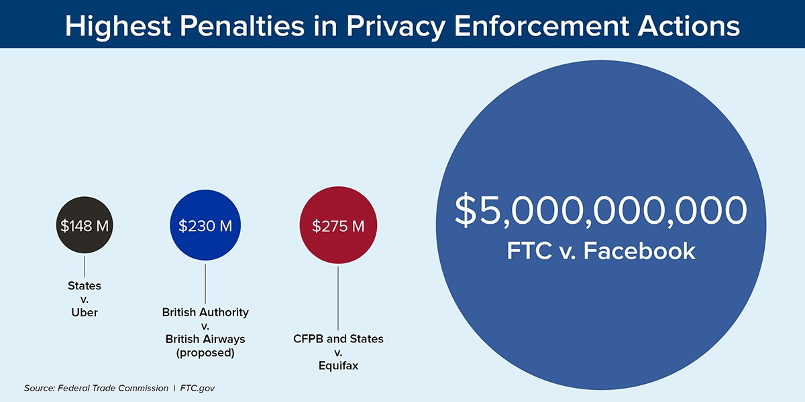
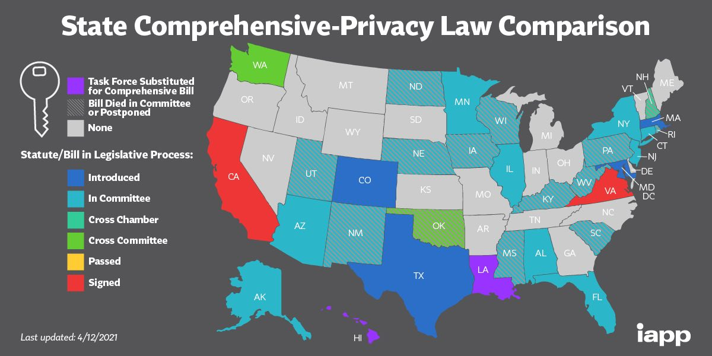

# Law: Regulation in the United States

## Introduction 

 There is no official legal legislative document passed by the federal government that covers data privacy or artificial intelligence regulation. Because the focus of this wiki is on "machine learning", and "data privacy", we will not discuss general legal regulation, such as Section 230. That being said, there are a patchwork of different policies enforced and handled by different federal agencies. These policies are based more on precedent, and can be changed at any time. In addition, on the state level there is in fact a wide variety of regulations that differ significantly on the state level. Simply attempting to cover the regulation of all states would be beyond the scope of this wiki, and be a major commitment. On the state level, only two states have managed to successfully pass data privacy regulation: California, and Virginia; meanwhile, we will cover an example of another state that has passed some incremental data regulation: Illinois. 

## The National Discussion

Policy regulation in the United States has been a mixed bag; there has been no national legislation that has been passed regulating AI, or it's uses, in the vein of GDPR in the EU.  However, on the state level, there has been significant legislation passed, regulating the use of artificial intelligence by establishing privacy rights for consumers. The discussion in the United States is still vibrant, and it is not unreasonable to believe that future legislation is incoming. 


Interestingly enough, the area of Deep Fakes has been a vibrant source of federal debate. There have been provisions that pertain to AI, for example, in 2019, the National Defense Authorization Act contained a provision regarding deep fakes [@chipman2019]. In particular, the act set up standards for the government to deal with the weaponization of deep fakes by foreign governments, and also established "Deepfake Prize competitions" to fund additional research [@chipman2019]. Both the House and Senate had their own form of Deep Fake legislation in 2019: the Identifying Outputs of Generative Adversarial Networks (IOGAN) Act in the House, and the Deepfake Report Act of 2019 in the Senate. Neither piece of legislation successfully passed the converse chamber, and was able to be signed by the president. In culmination, the status of deep fake legislation seems to be a recognition that deep fakes are a potential problem worthy of regulation on the federal level, but no major bill attempting to ban or limit them have been proposed. 


The strong, and vibrant discussion of AI ethics in the United States makes it quite likely that future regulation should eventually pass. In February 2019, the House of Representatives introduced H.R. 153 "Supporting the Development of Guidelines for Ethical Development of Artificial Intelligence", which set up guidelines for accountability in automated decision making [@chae2020]. Later that year in April 2019, the Senate and House introduced the "Algorithmic Accountability Act" which would “impact assessments” on "automated decision systems in order to evaluate the impacts of the system’s design process and training data on “accuracy, fairness, bias, discrimination, privacy, and security" [@chae2020]. The same year, the Senate also introduced the "Commercial Facial Recognition Privacy Act" that would essentially have set up regulation covering the use of facial recognition technology, and introduced privacy rights for consumers in the case of this specific technology by banning their use by non-covered entities "without providing notice and obtaining their consent" from consumers [@chae2020]. Meanwhile, the White House, in 2019 released a memo titled "Guidance for Regulation of Artificial Intelligence Applications" [@vought2020]. Notably in 2019,the FTC fined Facebook $5 billion for "deceiving users about their ability to control the privacy of their personal information", at the time more than twenty times larger than any other privacy enforcement fine levvied by the FTC [@henderson2019]. However, none of this information has resulted in significant federal legislation regulating AI systems. The information cumulatively suggests that while there is an appetite for AI regulation, the United States is not yet at a point where such regulation can be passed on a national level. 

```{r ftc, echo = FALSE, fig.cap = "FTC 2019 penalty for Facebook",width=500}

```

## California

In 2018, California passed the California Consumer Privacy Act (CCPA). The legislation established a series of data privacy rights, all of which affect trained AI models, such as, the "right to know" what personal information a business collects on them, the "right to delete" personal information, the "right to opt-out" of sale of their personal information [@becerra]. Penalties are quite severe, and start at \$2,500 for each violation, and \$7,500 for each "intentional subsequent violation" [@friel2019]. 

In addition, California Privacy Regulation Act (CPRA) passed in November 2020 builds on the CCPA and is scheduled to go into effect January 1, 2023 [@bahar2021]. Essentially, this second bill creates a new agency in California, the "Creation of the California Privacy Protection Agency" (CPPA), an agency which is vested with enforcement of the CCPA and CPRA. With regards to new rights and regulations, this new piece of regulation establishes a new right to correction for consumers to correct incorrect data. Opt-in consent is required for collection of all personal information for children under the age of 16. The right to limit use of personal consumer information is also added. Businesses are faced with more severe data retention limits, and are required to disclose data retention periods. Consumers are also given additional rights to opt-out of the disclosure of personal information. The act also establishes a stronger right to private action for any citizens that experience "the unauthorized access and exfiltration, theft, or disclosure of an email address in combination with a password or security question and answer that could permit access to content".

All in all, the information suggests that while the federal government may not be providing a source of active legislation, the states are functioning as a laboratory for legislation. Thus, while no significant legislation currently exists, it is very reasonable to expect significant legislation to appear in the upcoming years.

## Virginia 

As of March 2021, Virginia became the second state to pass comprehensive data privacy legislation; their legislation is modeled on California's CCPA which is in turn modeled on the European Union's GDPR [@southwell2021]. This legislation titled the "Virginia Consumer Data Privacy Act" (VCDPA) is scheduled to go into effect on January 1, 2023. The bill applies to all entities who “who conduct business in the commonwealth of Virginia or produce products or services that are targeted to residents of the Commonwealth” and either "control or process personal data of at least 100,000 Virginia residents, or "derive over 50\% of gross revenue from the sale of personal data (though the statute is unclear as to whether the revenue threshold applies to Virginia residents only) and control or process personal data of at least 25,000 Virginia residents". Notably, the bill carves out a series of exemptions for healthcare institutions, non-profits, and institutes of higher education.

With regards to data privacy, the bill establishes a series of rights in the vein of California's CCPA, and CRPA. One major difference between the Virginia VCDPA and the CCPA that it "leav[es] enforcement entirely up to the Attorney General and [does not provide] even a private right of action for consumers." Each violation can bring a fine of up to \$7500 to be levied by the attorney general's office [@southwell2021]. The VCDPA also falls short in that it does not offer consumers "a private right to action" "for consumers whose nonencrypted and nonredacted personal information was subject to unauthorized access and exfiltration" [@southwell2021].

With regards to rights established, several consumer rights are established. On the consumer side, consumers gain rights to "access, correction, deletion, data portability, and anti-discrimination" regarding their data [@southwell2021]. Consumers also gain the "right to opt-out of sale of personal data, targeting advertising, and profiling". Finally, consumers gain the right to consent for processing of "sensitive personal information" (essentially any sort of personally identifiable personal information, sexual orientation or immigration status), essentially forcing such data processing to become an "opt-in" decision for consumers. Businesses are required to engage in "data minimization and technical safeguard requirements",  and "data protection assessments and data processing agreements". The former essentially requires companies to minimize the amount of data they collect, and establishes standards for companies to take reasonable steps to ensure safety of personal consumer data. The latter requires companies to lay out mechanisms and standards to process and delete data when consumers request so.

## Illinois

Illinois has not had any comprehensive data privacy or artificial intelligence regulation, rather choosing to engage in a "patchwork" approach with regards to data regulation. The Illinois General Assembly introduced the "Artificial Intelligence Video Interview Act" which established a rights for prospective employees whose video interviews would be evaluated by AI [@greenberg2021]. Said legislation required that employers notified interviewees if their video interviews would be evaluated by AI, and required employers to explain "how the artificial intelligence works and what general types of characteristics it uses to evaluate applicants" [@greenberg2021].

In addition, like, California, the Illinois House introduced and passed a privacy bill, titled the "2020 Illinois Data Transparency and Privacy Act" [@stauss2020]. This law affects all "natural persons residing in Illinois", and applies to businesses that "collects or discloses the personal information of 50,000 or more persons, Illinois households, or a combination thereof", and businesses that "derive 50\% or more of its annual revenues from selling consumer’s personal information". It establishes a series of sweeping data privacy rights for consumers, such as the "right to know", the "right to opt out", the "right to correction", and "right to deletion". While the "right to correction" and "right to deletion" are fairly straightforward, the "right to know" establishes a right for consumers to request which companies have their information and the information that companies have on them. In addition, the "right to opt out" establishes a right to opt out of "disclosure [or sale] of personal information from a business to third parties", and "the processing of personal information". Unlike the California law, this bill did not successfully never received a vote in the Senate, and thus did not become law. Nontheless, the fact that such a bill was passed in one chamber of the state legislature strongly supports the notion that addition GDPR-style regulation will come for additional states besides California and Virginia.

## Other States
Roughly 30 states have introduced some sort of general consumer data privacy act, yet only two (Virginia and California) have managed to get those same bills passed or signed [@rippey2021]. The remaining 28 states have had their state bills die in the legislative process. Just as with Illinois, state legislation has regularly been introduced. 

```{r states, echo = FALSE, fig.cap = "State data privacy regulation  as of April 2021",width=500}

```

One of the advantages of the United States is it's Federalist system, wherein states operate like legislative laboratories for the Federal Government. It certainly appears that before additional federal legislation appears, additional state legislation will need to appear and be enacted. 


## Conclusion
Regardless, it seems like a variety of rights are here to stay. Specifically, the right to correction, nondescrimination, mandatory encryption, and possibly the right to consent for processing of personal information. The right to opt-out of the sale of personal data, likewise with it's appearance in Virginia and California and other GDPR inspired rights are here to stay. Even if the rights have yet to be codified,; it seems likely that data minimization for businesses are here to stay in the future. 

## Resources

**An article to read: ** "Garbage in, Garbage Out" by Claire Garvey https://www.flawedfacedata.com/# 
**A story to read: ** [____]
